# RAVIR - Retinal Vessel Segmentation 
This directory contains code of network architectures, run experiments and code for loading and processing of the images. 

<b>Disclaimer: The majority of the code was written using the PyCharm collaboration tool. Consequently, the contribution 
frequency might be skewed, even though both team members contributed equally to this project/labs.</b>


## How to Run the Code?
The [main.py](code/main.py) file loads the trained models and does sample predictions.
It loads the baseline U-Net, the binary U-Net, the ResU-Net and the weighted U-Net. (<b> Notice that the models could
not be uploaded to it due to their size. Instead, they have been uploaded to the KTH server.</b>)

The directory [experiments](code/experiments) contains the python scripts that were used in the experiments that are 
described below. Here, [baseline_unet.py](code/experiments/baseline_unet.py) contains all parameters for the baseline
U-Net, [grid_search_base_unet.py](code/experiments/grid_search_base_unet.py) contains all settings that were used for
the grid search, [unet_weighted_masks.py](code/experiments/unet_weighted_masks.py) contains the script to run the 
training with the dilated masks and [residual_unet.py](code/experiments/residual_unet.py) was used to train the ResU-Net.
All files in the directory can be re-run again to repeat the respective experiment. 

In the [code](code) directory, all python code can be found including the metrics, losses, and network architectures. 

The [dataset](dataset) directory includes all training and test images with the respective segmentation masks. 

The [grid_search](grid_search) directory contains the result of the gridsearch as .json files, where each json file
corresponds to one set of parameters. 

Finally, the [predictions](predictions) directory contains the predictions for each model in the correct file format to 
submit them to the challenge on grand-challenge.org. 

## RAVIR Dataset
The dataset was taken from the grand-challenge.org page for the segmentation challenge. (https://ravir.grand-challenge.org)

There are 23 training and 19 test retinal vessel images in the dataset. Each image has 768x768 pixels, where each pixel 
corresponds to 12.5 microns in the physical space. All images are grayscale images and all images contain arteries and
veins. The ground truth segmentation masks contain 3 classes. (0: Background, 128: Arteries, 256: Veins) 

The objective of the challenge is to correctly segment veins and arteries in the image. 

### Challenges of the Dataset
- Small dataset
- Varying image quality (contrast as well es sharpness)
- Very thin structures
- High similarity between veins and arteries
- Arteries and veins overlap
- Large images
- Long range prediction of the vessels

### Metrics
Since the challenge is ranked by using the mean DSC score, we used mean DSC (averaged over all foreground classes).
Furthermore, Jaccard is reported in the challenge, thus we used it as a metric as well. In addition to the metrics used 
in the challenge, we also report recall and precision.  

#### Sample Images
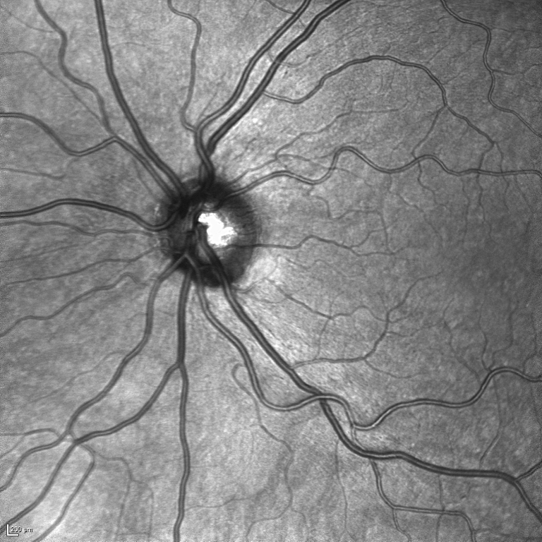
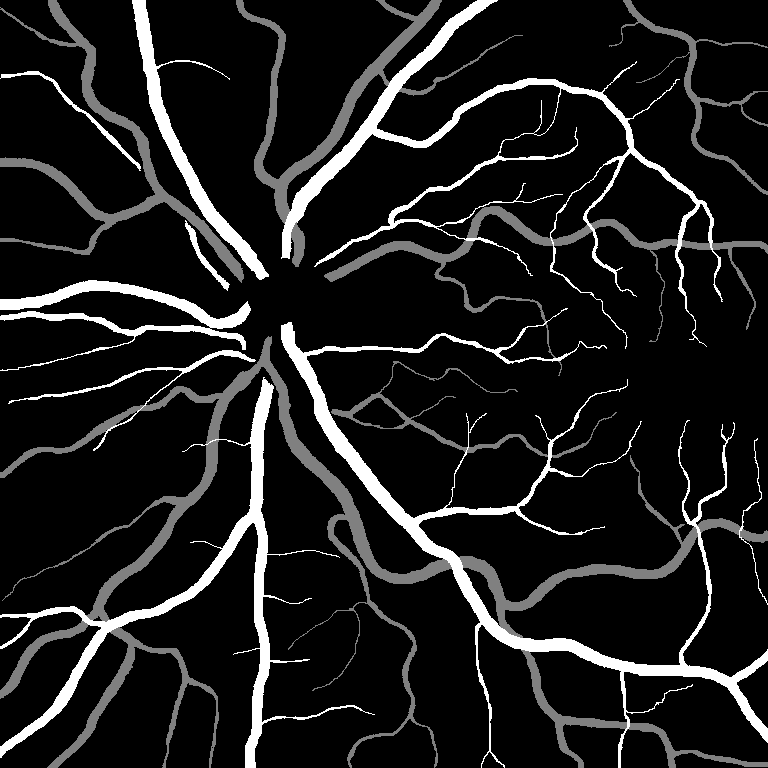
<br>
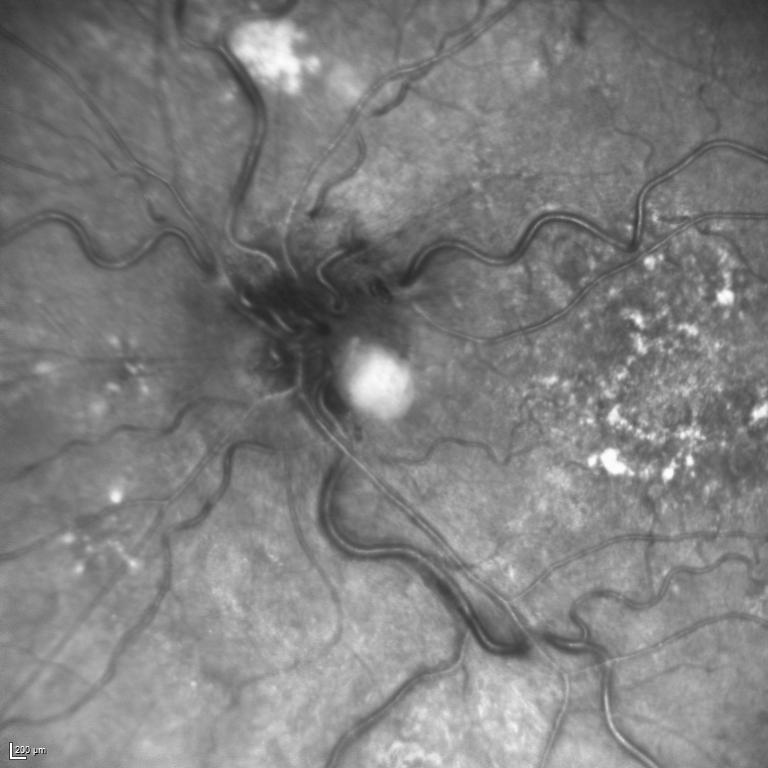
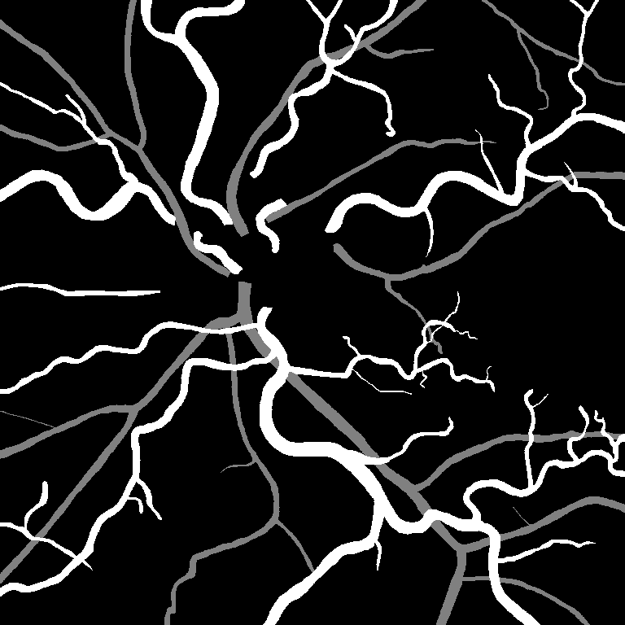

## Segmentation Pipeline
This segment describes the whole segmentation pipeline that was used int the experiments.
### Preprocessing
Random patched of size 256x256 were drawn for training the network to reduce memory 
demand and as a kind of augmentation. 

The masks were loaded and converted from grayscale to one-hot encoding. Furthermore, the corresponding patched were 
drawn for training of the network.

All images and masks were loaded in the GPU to increase training time and reduce CPU memory usage.

Furthermore, intensity scaling was tested, but was removed eventually, as it didn't improve the segmentation results.

### Training
For all experiments, the Adam optimizer [[4]](#4) was used. Furthermore, for the hyperparameter optimizatiion, the 
training dataset was split into 19 train images and 4 validation images and trained the networks using the leave-1-out 
approach. For the final evaluation of our algorithms, we trained the networks on all available training data and uploaded
the predictions of the test set to the challenge website.

All used network architectures were modifications of the original U-Net <a id="1">[1]</a> paper.

### Postprocessing
The trained network was applied on all images in the dataset. All predictions were converted from one-hot-encoding to
grayscale segmentation maps that correspond to the challenge requirements using argmax.  

## CNN Architectures used in the challenge
### U-Net [[1]](#1)

<figure>

<figcaption>Original U-Net diagram</figcaption>
</figure>

### Residual U-Net [[2]](#2)
Residual U-Net allows us to take advantage of U-Net in which we combine low level detail information with high level 
semantic information and Residual networks using identity mapping [[5]](#5) that facilitates training.
Residual unet

<figure>

<figcaption>Original ResUnet diagram</figcaption>
</figure>


## Experiments
### Setting Up The Baseline U-Net
First, we set up a baseline U-Net with slight modifications to the original U-Net paper.
(i.e. batch normalization, spatial dropout, padding: same) This model was used to compare the results against to and as a 
starting point for the following experiments. 

The hyperparameters were determined using a grid search. Following hyperparameters were included in the grid search:
```python
grd_srch_n_base = [16, 32, 64]
kernel_size = [(3, 3), (5, 5)]
learning_rate = [0.001, 0.0001]
alphas = np.array([1, 0.8, 0.6, 0.4])
```
All other hyperparameters were determined using experience from prior labs in the CM2003 course.

In the baseline U-Net, no augmentation was used. 

The objective of this experiment was to choose the set of hyperparameters that results in the best DSC. 

### Data Augmentation
In addition to the search of the best hyperparameters for our model, we implement the following data augmentation:
```python
rotation_range = 10,
width_shift_range = 0.2,
height_shift_range = 0.2,
zoom_range = [0.1, 1.4],
horizontal_flip = True,
fill_mode = 'reflect',
```

### Binary Classification
Since the previous experiments showed worse results than expected, the main hypothesis was that the vessels are
detected but classified poorly into arteries and veins. Thus, we performed this experiment, where we trained a U-Net 
using the result of the grid search as hyperparameters but using only binary segmentation maps. (i.e. arteries and veins
were merged into class "vessel")

### Training Using Weight Maps
In order to improve the detection of veins and arteries we try implementing weight maps which would add additional 
loss penalty to the most important features in images. Weight maps were created using <em>scikit-image</em> package by 
dilation of the provided original segmentation masks using a ```sitk.Ball``` kernel shape with a radius 2. 
Code for creating weight maps provided in <em>[preprocessing.py](code/preprocessing.py)</em>


|            Dilation weight map for IR_Case_034            |           Original mask for IR_Case_034           |
|:---------------------------------------------------------:|:-------------------------------------------------:|
| 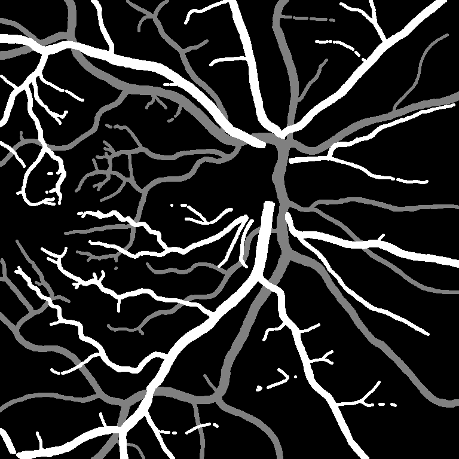 | 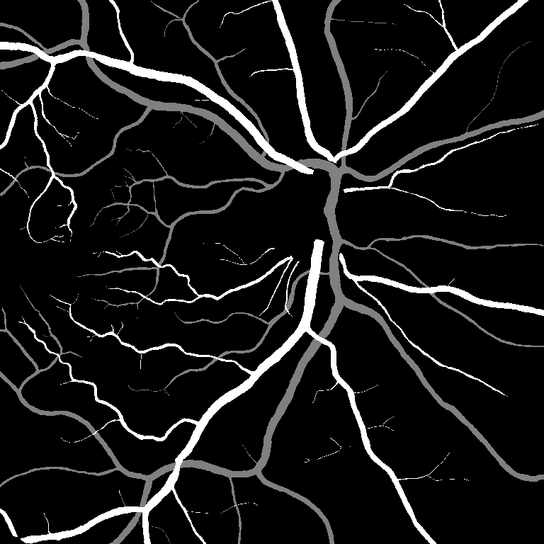 |


### Setting Up The Residual U-Net
Original Residual U-Net has been modified by adding one more residual block to increase the depth of the network.
Due to a small dataset, the original ResUnet has been modified by adding spatial dropout.
Used Architecture can be found in <em>[ResUnet.py](code/ResUnet.py)</em>

## Results and Discussions
### Grid Search
In the following table, the best 5 cases of the grif search and their parameters can be seen. The table is sorted from
best to worst validation dice score. To improve robustness of the choice of hyperparameters and to suppress noise, the
metrics were averaged over the last 5 epochs. It can be seen that the two best networks both use 64 feature maps on
the first level of the U-Net. It can be also seen that the best network is superior in all metrics, including pecision 
and recall. Furthermore, it should be noted that the parameter "alpha" refers to the weight that was
used in the weighted combined loss that incorporated dice loss and cross entropy loss.  

For the following experiments, the hyperparameter-set of the best network in this case has was used.  


| n_base | learning_rate | alpha | kernel_size | augmentation | epochs |   loss   | val_loss | dice_coef | val_dice_coef | precision | val_precision |  recall  | val_recall | jaccard  | val_jaccard |
|:------:|:-------------:|:-----:|:-----------:|:------------:|:------:|:--------:|:--------:|:---------:|:-------------:|:---------:|:-------------:|:--------:|:----------:|:--------:|:-----------:|
|   64   |    0.0001     |  0.4  |   [3, 3]    |     None     |  700   | 0.131769 | 0.209682 | 0.805162  |   0.654791    | 0.953546  |   0.936545    | 0.953546 |  0.936545  | 0.911267 |  0.880820   |
|   64   |    0.0001     |  0.6  |   [3, 3]    |     None     |  700   | 0.197164 | 0.269131 | 0.739774  |   0.637601    | 0.942663  |   0.930478    | 0.942663 |  0.930478  | 0.891680 |  0.870212   |
|   32   |    0.0001     |  0.6  |   [3, 3]    |     None     |  700   | 0.229841 | 0.270891 | 0.692221  |   0.635036    | 0.937279  |   0.929765    | 0.937279 |  0.929765  | 0.882102 |  0.869073   |
|   32   |    0.0001     |  0.8  |   [3, 3]    |     None     |  700   | 0.317092 | 0.335769 | 0.651637  |   0.620721    | 0.930788  |   0.922410    | 0.930788 |  0.922410  | 0.870864 |  0.856485   |
|   32   |    0.0001     |  0.4  |   [3, 3]    |     None     |  700   | 0.162371 | 0.236693 | 0.747658  |   0.616998    | 0.944697  |   0.922116    | 0.944697 |  0.922116  | 0.895331 |  0.855859   |

### Baseline Model
In the following table, the result of the baseline U-Net can be seen. These results were calculated on the test set 
automatically by the challenge entry. As of the date of our first submission, the best achieved Dice score in the 
challenge was 0.81. It should be noted that the test dice is substantially worse than the validation dice that was 
achieved during the grid search. 

| Dataset |   Mean Dice   |  Artery Dice  |   Vein Dice   | Mean Jaccard  | Artery Jaccard |
|:-------:|:-------------:|:-------------:|:-------------:|:-------------:|:--------------:|
|  Test   | 0.4208±0.0586 | 0.3599±0.0535 | 0.4818±0.0646 | 0.2702±0.0483 | 0.2207±0.0402  |

#### Discussion
The test dice is substantially worse than the validation dice. Thus, the chosen data-split of the training data might not represent the test set very 
well or includes "easier" cases. It can be also seen that the vein Dice of our model is substantially better than the 
artery dice. 

This behaviour could maybe be improved by using weight maps that weigh the arteries higher. The main problem on the 
dice metric is the miss-classification of vessels again rather than the vessel-detection. Thus, increasing the receptive
field might help with improving the long range predictions here. Also, a patched based training was used, due to memory 
limitations. This might have reduced the ability of the network to make long range predictions as well. 

Adding augmentation to the baseline model was also tested but did not improve the segmentation results substantially and
thus, was excluded from this report. 

### Baseline U-Net with weight map

While evaluating the model using 0.2 validation split we obtain training curves that can be seen below. The validation 
dice coefficient values around 0.5, however the scores achieved in the challenge are substantially lower (Mean Dice coefficient 0.3314±0.0632).

<p style="text-align: center;">Metrics for the model trained with validation</p>

|                              Loss                              |                      Dice Score                      |                           Precision                            |                           Recall                            |                        Jaccard Score                         |
|:--------------------------------------------------------------:|:----------------------------------------------------:|:--------------------------------------------------------------:|:-----------------------------------------------------------:|:------------------------------------------------------------:|
| 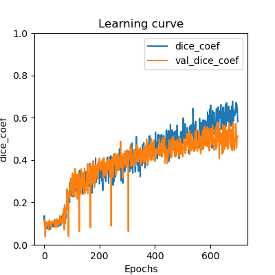 | 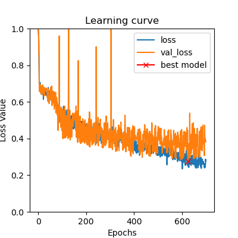 | 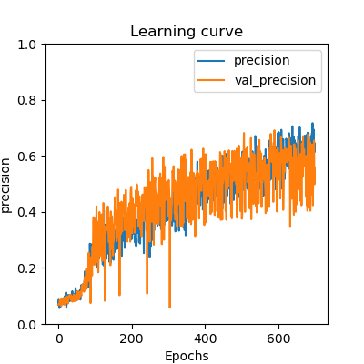 | 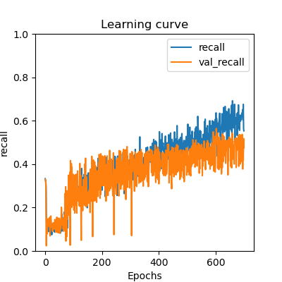 | 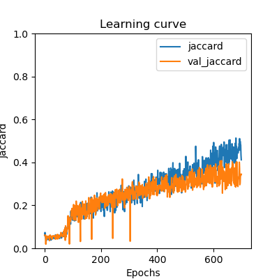 |

<p style="text-align: center;">Challenge results for the model trained with validation</p>

| Dataset |   Mean Dice    |  Artery Dice  |   Vein Dice   | Mean Jaccard  | Artery Jaccard |
|:-------:|:--------------:|:-------------:|:-------------:|:-------------:|:--------------:|
|  Test   | 	0.3314±0.0632 | 0.2841±0.0539 | 0.3788±0.0734 | 0.2014±0.0467 | 0.1666±0.0371  |

<p style="text-align: center;">Metrics for the model trained without validation - Full train dataset</p>

|                                 Loss                                  |                         Dice Score                          |                               Precision                               |                               Recall                               |                            Jaccard Score                            |
|:---------------------------------------------------------------------:|:-----------------------------------------------------------:|:---------------------------------------------------------------------:|:------------------------------------------------------------------:|:-------------------------------------------------------------------:|
| 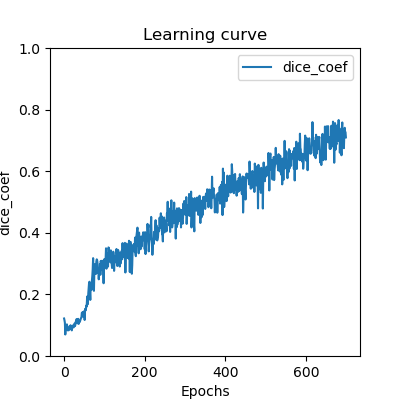 | 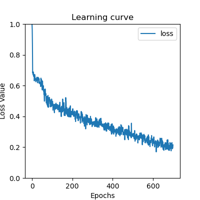 | 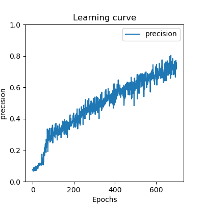 | 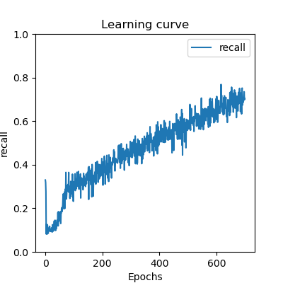 | 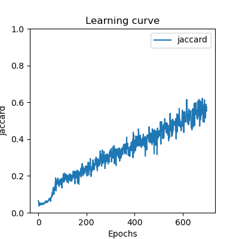 |


<p style="text-align: center;">Challenge results for the model trained without validation - Full train dataset</p>

| Dataset |   Mean Dice    |  Artery Dice  |   Vein Dice   | Mean Jaccard  | Artery Jaccard |
|:-------:|:--------------:|:-------------:|:-------------:|:-------------:|:--------------:|
|  Test   | 	0.4326±0.0498 | 0.3732±0.0463 | 0.4919±0.0545 | 0.2791±0.0416 | 0.2304±0.0352  |

#### Discussion

The results achieved using weight maps when we used 19 images for training and 4 images for validation were the worst 
out of all trials during this project. However using the entire train data set for training allowed us to achieve the 
highest scores out of all methods. It shows the importance of using all possible images while working on very small datasets.

### Binary classification
|                  Loss                  |               Dice Score               |                  Precision                  |                  Recall                  |
|:--------------------------------------:|:--------------------------------------:|:-------------------------------------------:|:----------------------------------------:|
| 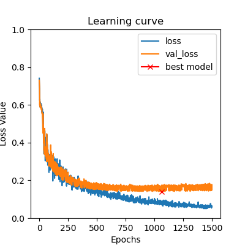 | 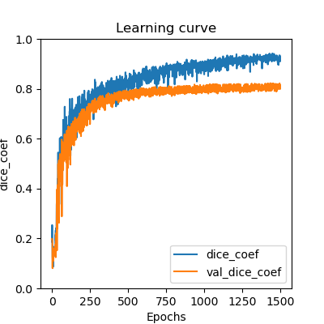 | 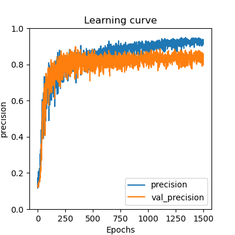 | 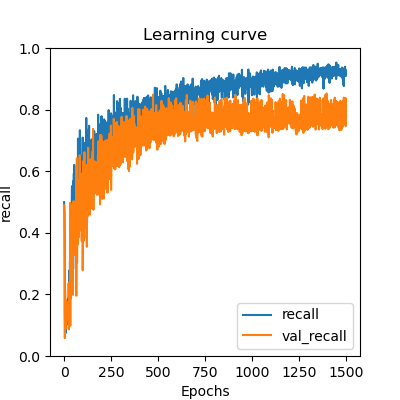 |

It can be seen in the learning curves above, that the training metrics as well as the validation metrics all increase
when using a binary classification. The loss and all metrics seem to be converged. Furthermore, it should be noted, 
that there is a difference between the training and validation loss and metrics. Since the validation loss is higher and
the validation metrics are lower than the respective curves for the training data, it can be concluded that the model is 
slightly overfitting. 

#### Example of Bad Segmentation
The image IR_Case_058.png was segmented poorly. In the following image, the difference between the ground truth and 
prediction can be seen. The <b>black pixel denote pixels that have been segmented correctly, the white pixel denote false 
positive segmentations</b> and the <b>gray pixels denote false negative pixels</b>. It can be seen that the boundaries are not 
segmented perfectly and also that some vessels were not detected. The Dice sore for the following segmentation is 0.74.

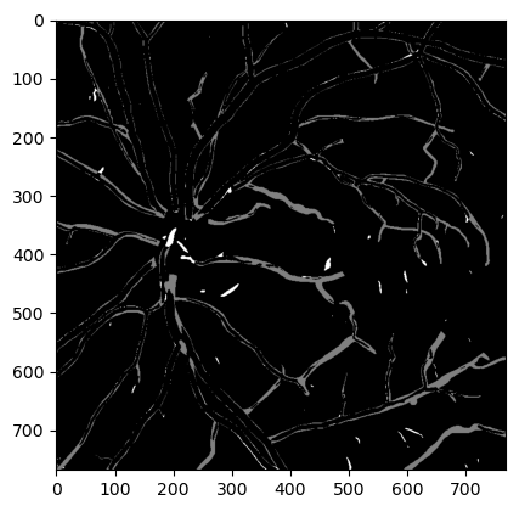

#### Discussion
It can be seen that the metrics for the binary classifications are substantially higher than the metrics for the 
multiclasss-classification. It seems to be the case, that the baseline U-Net is able to segment the vessels quite 
robustly and that the challenge in this dataset is not necessarily the segmentation of the vessels but rather the correct
classification of veins and arteries. This seems to require long range prediction, as some vessels change their class 
along the vessel in the prediction of our multiclass models. 

Furthermore, it should be noted that the binary model achieves a Dice score of around 0.8 on the validiation data.
Even though, this dice score is reasonably high, the network fails to properly segment the thin parts of the vessels. This
might be caused by under-representation of thin vessels in the Dice score. (i.e. there are more thick vessels that are 
easier to segment and consequently weigh more in the dice score) 

Since the segmentation metrics are quite good already and the classification of the vessel type seems to be the problem, 
we do not expect a substantial improvement in the segmentation result for the multiclass segmentation when using 
transfer-learning using a network that was pretrained on a binary retinal-vessel dataset such as the DRIVE dataset.


### Baseline ResUnet Model
First we train our baseline ResUnet model using a train/validation split described in the [Training](#training) section to see how it performs.

|                                  Loss                                  |                          Dice Score                          |                               Precision                                |                               Recall                                |                            Jaccard Score                             |
|:----------------------------------------------------------------------:|:------------------------------------------------------------:|:----------------------------------------------------------------------:|:-------------------------------------------------------------------:|:--------------------------------------------------------------------:|
| 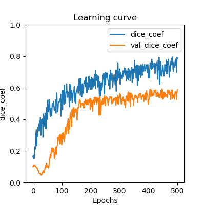 | 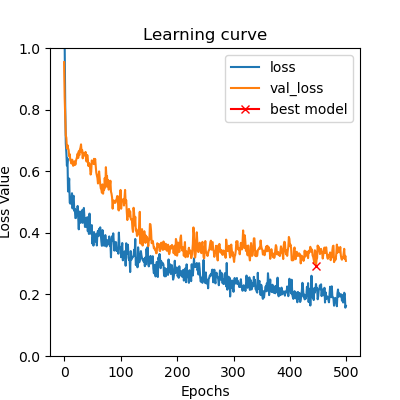 | 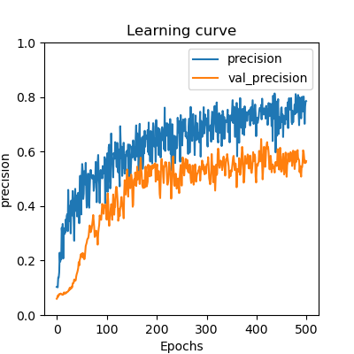 | 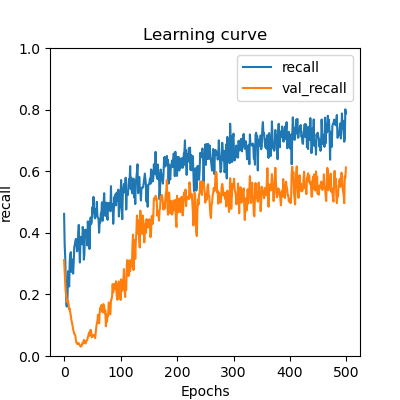 | 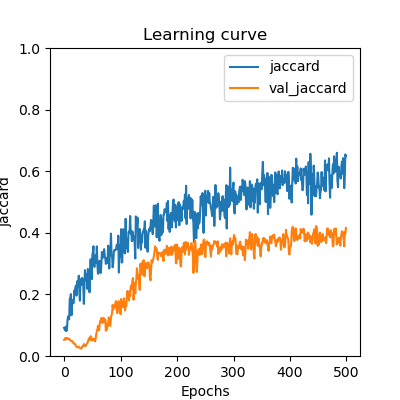 |

In the learning curves above we can see that the model is overfitting and that the validation curve reaches a plateau 
after approximately 250 epochs and does not significantly increase during further training however the train metrics keep improving.

Metrics presented below were plotted for the training dataset consisting of all train images without the validation set.

|                             Loss                              |                     Dice Score                      |                           Precision                           |                           Recall                           |                        Jaccard Score                        |
|:-------------------------------------------------------------:|:---------------------------------------------------:|:-------------------------------------------------------------:|:----------------------------------------------------------:|:-----------------------------------------------------------:|
| 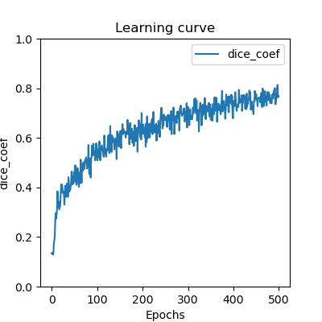 | 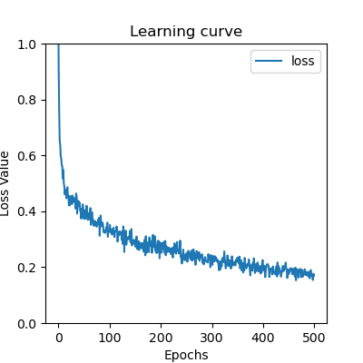 | 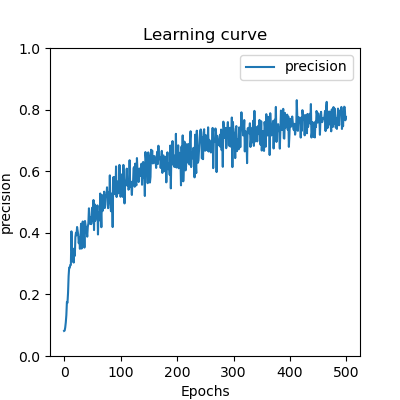 | 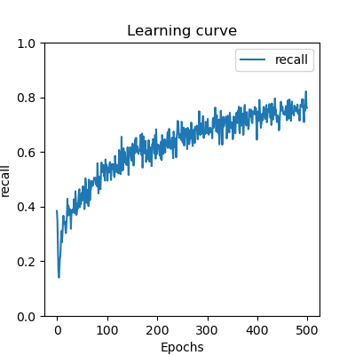 | 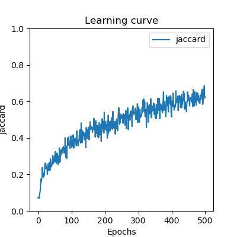 |

Predictions from the model trained on all images were uploaded to the RAVIR challenge for evaluation and resulted in the following results:

| Dataset |   Mean Dice    |  Artery Dice  |   Vein Dice   | Mean Jaccard  | Artery Jaccard |
|:-------:|:--------------:|:-------------:|:-------------:|:-------------:|:--------------:|
|  Test   | 	0.4290±0.0583 | 0.3673±0.0531 | 0.4906±0.0645 | 0.2768±0.0478 | 0.2262±0.0400  |

We notice that the mean Dice and Jaccard Scores are lower when computed on the challenge are lower than the ones computed
by us which means that metrics we use are not representative of the actual scores


## Suggested further improvements/ideas
- ResUnet-a is based on the Residual U-Net which uses diluted convolutions to improve the receptive field of the network [[3]](#3)
- Using weight maps that have a higher weight for thinner structures to emphasize those regions in the training.
- Avoid having to draw patches by using a lower resolution model for the center and a high resolution model for smaller parts of the vessels. 
## References
<a id="1">[1]</a>
O. Ronneberger, P. Fischer, and T. Brox, “U-Net: Convolutional Networks for Biomedical Image Segmentation.” arXiv, May 18, 2015. doi: 10.48550/arXiv.1505.04597.

<a id="2">[2]</a>
Z. Zhang, Q. Liu, and Y. Wang, “Road Extraction by Deep Residual U-Net,” IEEE Geosci. Remote Sensing Lett., vol. 15, no. 5, pp. 749–753, May 2018, doi: 10.1109/LGRS.2018.2802944.

<a id="3">[3]</a> 
F. I. Diakogiannis, F. Waldner, P. Caccetta, and C. Wu, “ResUNet-a: a deep learning framework for semantic segmentation of remotely sensed data”, ISPRS Journal of Photogrammetry and Remote Sensing, vol. 162, pp. 94–114, Apr. 2020, doi: 10.1016/j.isprsjprs.2020.01.013.

<a id="4">[4]</a> 
D. P. Kingma and J. Ba, “Adam: A Method for Stochastic Optimization,” in 3rd International Conference on Learning Representations, ICLR 2015, San Diego, CA, USA, May 7-9, 2015, Conference Track Proceedings, 2015. [Online]. Available: http://arxiv.org/abs/1412.6980

<a id="5">[5]</a> 
K. He, X. Zhang, S. Ren, and J. Sun, “Identity Mappings in Deep Residual Networks.” arXiv, Jul. 25, 2016. doi: 10.48550/arXiv.1603.05027.


